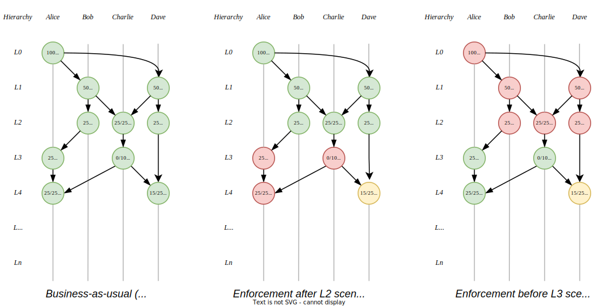

<h1 align="center">

</h1>

## Abstract

> TODO

## Motivation

The present-day Central Bank Digital Currency concept aims to utilize the advantages of blockchain or Distributed Ledger Technology (DLT) that provide immutability, transparency, and security, and adopts smart contracts, which plays a key feature in creating programmable money. However, technology itself gives an advantage and eliminates the problem ideally of compliance with the regulator and AML/CFT standard, but it does not seem practical to be done in the real world and is not efficiently responsible for the financial crime or incidents that occur in the open network of economic.

## Specification

The key words “MUST”, “MUST NOT”, “REQUIRED”, “SHALL”, “SHALL NOT”, “SHOULD”, “SHOULD NOT”, “RECOMMENDED”, “NOT RECOMMENDED”, “MAY”, and “OPTIONAL” in this document are to be interpreted as described in RFC 2119 and RFC 8174.

``` Solidity
// SPDX-License-Identifier: Apache-2.0
pragma solidity >=0.8.0 <0.9.0;

/**
 * @title Interface for Forest
 */

interface IForest {
    // events
    event TransactionCreated(bytes32 indexed root, bytes32 id, address indexed from);
    event TransactionSpent(bytes32 indexed id, uint256 value);

    // errors
    error TransactionNotExist();
    error TransactionInsufficient(uint256 value, uint256 spend);
    error TransactionZeroValue();

    // functions
    function hierarchyOfGraph(bytes32 tokenId) external view returns (uint256);
    function levelOfToken(bytes32 tokenId) external view returns (uint256);
    function ownerOfToken(bytes32 tokenId) external view returns (address);
    function parentOfToken(bytes32 tokenId) external view returns (bytes32);
    function rootOfToken(bytes32 tokenId) external view returns (bytes32);
    function tokenExists(bytes32 tokenId) external view returns (bool);
    function valueOfToken(bytes32 tokenId) external view returns (uint256);
    function transfer(address to, bytes32 tokenId, uint256 value) external returns (bool);
    function transferFrom(address from, address to, bytes32 tokenId, uint256 value) external returns (bool);
}
```

### Function Behavior

#### Create Transaction
- The `value` of the transaction **MUST NOT** be zero. If `value` is 0, the function **MUST** revert.  
- The transaction **MUST** be assigned a unique `id`. The `id` **SHOULD** be derived using the deterministic hashing function.  
- The new transaction **MUST** include the correct parent field:
If the transaction is derived (e.g., created by spender), the `parent` field **MUST** reference the `id` of the original transaction.
If the transaction is a `root` transaction, the parent field **MAY** be set to `0x0`.
- The events `TransactionCreated` **MUST** emit when created new transaction.

#### Spend Transaction
- The spending action **MUST** verify that the transaction with the given `id` exists. If not function **SHOULD** return `false` or revert.
- The `value` to be spent **MUST NOT** exceed the `value` of the transaction. If it does, the function **MUST** revert.
- The `hierarchy` of the transaction's `root` **MUST** be incremented if the new transaction's level exceeds the current `hierarchy`.
- The events `TransactionSpent` **MUST** emit when spending transaction.

### Diagrams

<div align="center">
  
</div>

<!-- TODO explain -->

<div align="center">
  
</div>

<!-- TODO explain -->

## Rationale

| Features                                                                  | ERC-20 | UTXO | eUTXO | Forest |
| ------------------------------------------------------------------------- | ------ | ---- | ----- | ------ |
| Freeze the `sender` account.                                              | ✓      | ✓    | ✓     | ✓      |
| Freeze the `recipient` account.                                           | ✓      | ✓    | ✓     | ✓      |
| Freeze the certain `amount` token.                                        | ✗      | ✓    | ✓     | ✓      |
| Freeze the specifics `tokenId` or `txId`.                                 | ✗      | ✓    | ✓     | ✓      |
| Freeze the specifics `tokenId` or `TxId` that relevant to the root.       | ✗      | ✗    | ✓     | ✓      |
| Freeze all `tokenId` or `TxId` before or after specifics hierarchy level. | ✗      | ✗    | ✗     | ✓      |

- `ERC-20` provide events and keep tracking each `Transfer`,  
  but the problem is the `ERC-20` model can't separate `clean money` from `dirty money`,  
  due to the `ERC-20` not have `tokenId` to keep tracking each token when it's move.
- `UTXO` and `eUTXO` facing challenge to combine multiple `UnspentTransaction` and spent as one,  
  in case, user want to spend value that greater that selected `UnspentTransaction`.  
  Possible solution: prepare and batching as an array,  
  `UTXO` and `eUTXO` maintain the amount of money or group of money in each individual transaction.  
  Each `UnspentTransaction` is not underlying any account,
  so to spend the transaction, the caller needs to be the owner of the transaction that needs to be spent.
- `Forest` use to modify an existing state rather than create a new transaction, like in `UTXO` or `eUTXO` do,  
  it allows spending the transaction multiple times till it's met `0`, The `Forest` model enables tracking of child/subtree structures,  
  providing a hierarchical view of token flows and relationships,  
  which is not possible in traditional token standards like `ERC-20`, `ERC-1400`, and `ERC-3643`.

## Security Considerations

### Denial Of Service
Run out of gas problem due to the operation consuming higher gas if transferring multiple groups of small tokens or loop transfer.

### Gas Limit Vulnerabilities
Exceeds block gas limit if the blockchain has a block gas limit lower than the gas used in the transaction.

### Data Fragmentation

The `Forest` model tracks all assets within the system, which can be represented mathematically as

```math
assets = totalSupply \times decimals
```
While this ensures precision, the high granularity can increase storage needs. 
Traditional finance often uses simpler `decimals` like `2`, `4` or `6`, avoiding excessive detail. 
Adopting similar strategies could help balance granularity with efficiency.

### High Complexity
`Forest` may introduce potential vulnerabilities or misbehave when applied with other smart contract.

## Copyright

Copyright 2024 Sirawit Techavanitch. Licensed under the [Apache-2.0](./LICENSE)
